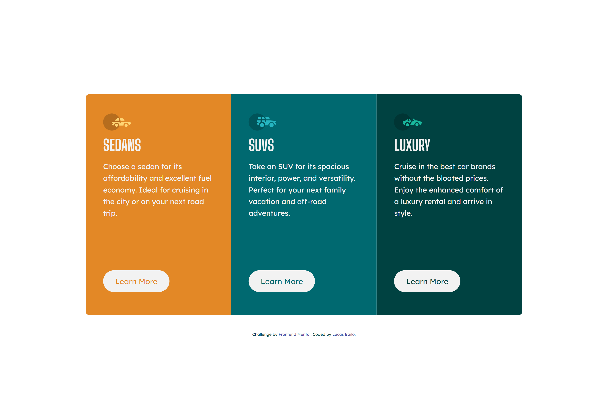

# Frontend Mentor - 3-column preview card component

This is a solution to the [Design preview for the 3-column preview card component coding challenge](https://www.frontendmentor.io/challenges/3column-preview-card-component-pH92eAR2-). Frontend Mentor challenges help you improve your coding skills by building realistic projects.

### Screen Shot

### Built with

- Semantic HTML5;
- CSS custom properties;
- Flexbox;
- Grid;
- Responsive Desgin.

## Author

- Website - [Lucas Bailo](https://github.com/lucasbailo)
- Frontend Mentor - [@lucasbailo](https://www.frontendmentor.io/profile/lucasbailo)
- Instagram - [@lucassbailo](https://www.instagram.com/lucassbailo/)